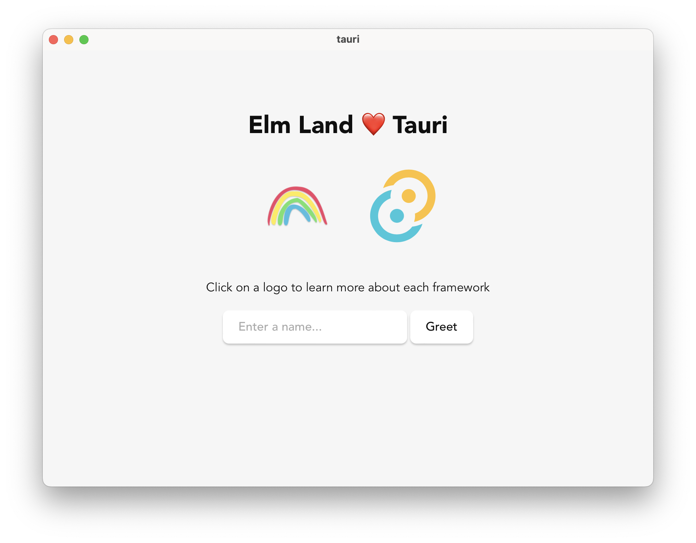

# @elm-land/tauri
> Use [Tauri](https://tauri.app/) to build desktop apps with Elm Land!



## Local development

You can run one command to start up your Elm Land server and Tauri application:

```
npm start
```